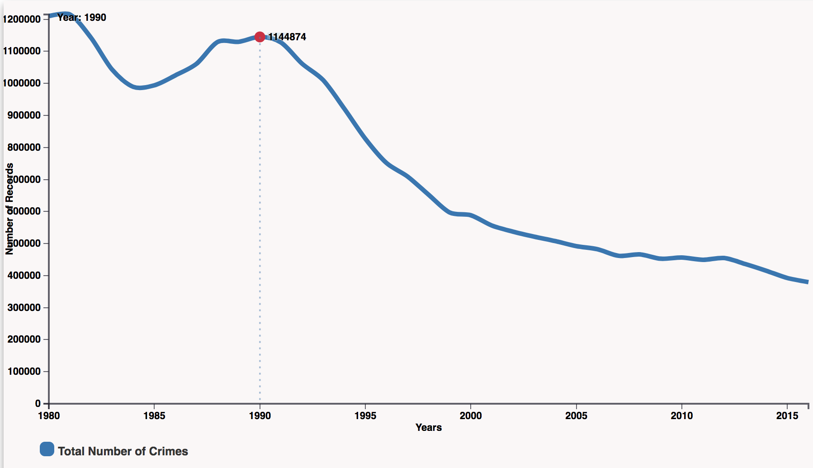
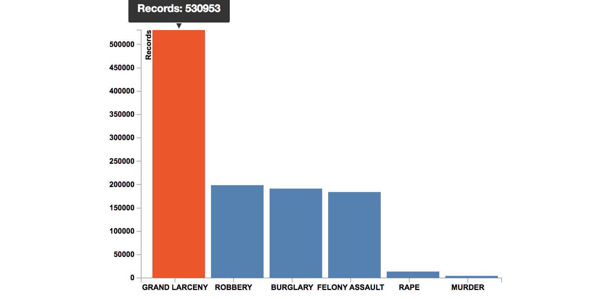
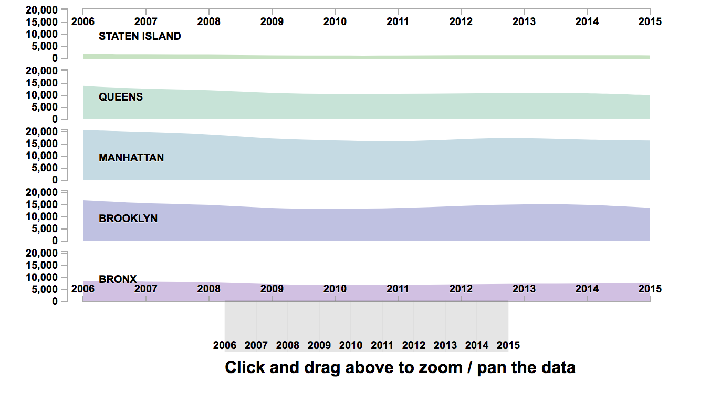
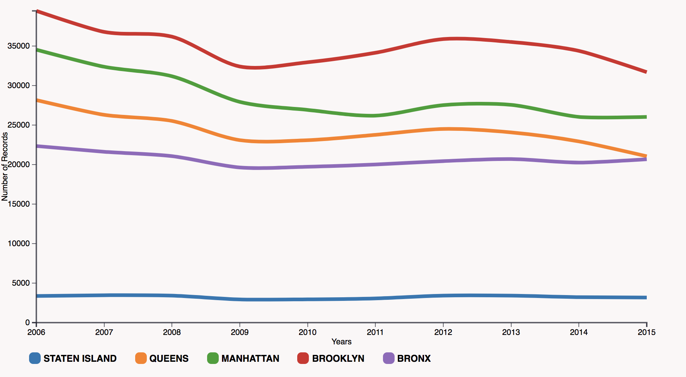
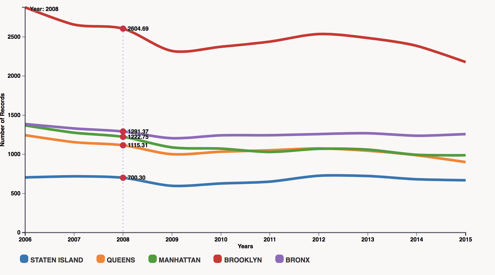

Shwetha Shyam Sunder, CS725-HW9, Spring 2018
# VSUALIZING CRIME REPORTED TO NYPD

## INTRODUCTION
Safety is one of the most fundamental needs for people. As one of the most populous urban agglomerations in the world, New York City is heaven for many, 
but perhaps hell for few, especially those who were unfortunately affected by the crime.

Violent crime in New York City has been dropping since the mid-1990s and, 
as of 2015, is among the lowest of major cities in the United States. 
Crime rates spiked in the 1980s and early 1990s as the crack epidemic hit the city.
According to a 2015 ranking of 50 cities by the economist, New York was the 10th-overall-safest major city in the world, as well as the 28th-safest in personal safety.
During the 1990s the <b>New York City Police Department (NYPD)</b> adopted <b>CompStat</b>, broken windows policing and other strategies in a major effort to reduce crime. 
The city's dramatic drop in crime has been attributed by criminologists to policing tactics, the end of the crack epidemic, and some have speculated more 
controversial ideas such as the legalization of abortion approximately 18 years previous and the decline of lead poisoning of children.

## QUESTION
This project investigates 6 crime, a.k.a, felonies, which occurred in NYC in the past 10 years (2006-2015). 
It focuses on answering the following simple yet important question:

Has NYC become safer over last 10 years?

## DATA
The NYPD maintains statistical data https://data.cityofnewyork.us which is used as a management tool in reducing crime, improving procedures and training, and providing transparency to the 
public and government oversight agencies. In 1994, Police Commissioner William Bratton implemented CompStat, which through management, statistics, and accountability, 
successfully drove down crime to record levels not seen since the 1960s.

The department provides up-to-date crime-related statistics in the six major crime categories on the citywide, borough, and precinct levels, as well as historical 
crime data. The public can also access this data through the department's CompStat 2.0 portal.

<b>The NYPD 6 Major Felony Incidents dataset:</b>

* Contains Six Major Felonies that is updated quarterly at the incident level.
* It was made public at Dec 29, 2015, and is available.
* Contains around 1.1 million incidents, 22 variables, and is 194MB in size.
* Contains approximate location of longitude and latitude across 5 boroughs.
* Contains timestamps of offense incidents (year, month, hour) spanning from 1919 to 2015.

<b>According to the NYPD Incident Level Data Footnotes:</b>

* Crime complaints which involve multiple offenses are classified according to the most serious offense.
* For privacy reasons, incidents have been moved to the midpoint of the street segment on which they occur.
* Attempted crimes are recorded as if the crime actually occurred.
* Data presented here is based on the year the incident was reported, not necessarily when it occurred.

The first point indicates that the number of actual incidents is larger than that in the dataset. Since we know nothing about which types of offenses are typically
associated together in incidents of multiple offenses, we can make no assumptions. The second point affects the accuracy of incident locations.  
Nevertheless, at the scale of borough or city level, the inaccuracy in longitude and latitude will not have a major impact on the overall distribution of incidents.

<b>Finally I am trying to tell that over the years, the crime rate in new york city has reduced. 
Also visualizing each crime in all borough, which shows the decrease in crime rate.</b>

# VISUALIZATION

My main question about this datsset is that, does New York has the decreasing trend over the years.
To answer my main question that is New York has the decreased in its crime over the years this last graph gives the clear answer.
I have done the modification to the chart 3 by adding population.
When population was considered there was a great change in the graph. Brooklyn still stands as the 1st but when you considered manhattan and other borough they have a huge variations in their trend.
manhattan almost has the same trend as the Bronx and queens but this was not the case in chart 3.
Also staen island has come little up after considering the population.

All the 5 Borugh has different color to differentiate. And when you hover on the chart, the total number crimes in particular year on the each borough appears.

There is also one more inference which I made from this graph. There is a steep decrease in crime rate in the year 2009-2011.
When I tried finding out why, I got to know that people started migrating from the cities due costly life in that particular year. Also after migrating people got good amount of salary with the living life not being so costly.

From the above analysis atleast it is clear that crime rate in New york has been reduced over the years. Also, while considering the population for the calculation the statement of decrease in crime becomes more strong. By introducing this compStat law enforcement we have this decreasing trend of the crime rate in New York city. NYPD has greater contribution for this decrease in trend.
No wonder New York is said to me 10th most safest place in the worl.
In the future work if we consider economic factor and also other factors, we can be even more clear in the decreasing trend of crime rate in the New York city.

# DESIGN DECISION

### Reported violent crime rate in the New york city from 1980 to 2015

My first goal was to visualize crime in a line chart. Trend kept ticking downward from 2006, more slowly and with some fluctuations, to the present day. 
By virtually any metric, Americans now live in one of the least violent times in the nation’s history.

### Comparision of the Felonies reported from 2006 to 2015

I chose bar graph to visualize this question, I wanted to see how are the crimes distributed in the boroughs over the last 10 years. 
This chart shows the comparisons between six felonies. 
This is a horizontal bar chart, which is sorted with highest crime Grand Larceny reported to the left most corner and Murder being the least.

Bar graph can be used to represent: Ranking, Nominal Comparisons, Part-to-whole, Deviation, or Distribution.

A bar graph is a chart that uses bars to show comparisons between the felonies.
Bar graph can have one category axis and up to two numerical axes. 
Category axis describes the types of categories being compared, and the numerical axes represent the values of the data.

The comparision in the felonies gives which crime is the highest occured over the years. 
According to the above graph Grand Larceny has the highest number of records over the years and murder is the least.
Burgraly, robbery and assualted felony has almost same level of crime records.
By choosing this bar graph we can compare as well as can see the trend in the crime.
When you hover on particualr crime the color changes from blue to red to have slight variations in the crime identificatio, also it shows the total number of records of that particular crime.

There is an interction for the user, when any of the felony is clicked there pops up a multiple area chart which visualises the 
particular crime rate in each of the 5 Borough.
All the 5 borough has be assigned with the different color to be clear which borough has the highest crime of the clicked crime.
This multiple area chart has the interction too, where user can choose between the years to visualize. 
The x axis is the year and the y axis is the number of crime records.

I have calculated the number of crime records using the Tableau. 

By choosing bar graph, two questions has been answerd. First being the highest occured crime and second each crime rate in all the borough.

### Reported violent crime rate in the 5 Boroughs of New york city from 2006 to 2015
 

I chose line graph to visualize this particular scenario because it is commonly used to display change over time as a series of data points connected by 
straight line segments on two axes. A multiple line graph is a graph that shows consecutive observation of all these 5 boroughs at once.
Also helps to determine the relationship between two sets of values, with one data set always being dependent on the other set. 
Good visual impression of trends and changes.
When you hover on the line crime record in the particular year appears on all the 5 boroughs at once. 
There is a data transformation for the graph which is the calculation of total number record for each borough over year using .

The 5 Boroughs have been assigned colors to differenciate from each other.

* Brooklyn has the most frequent number of crime of all 5 boroughs.  The number of incidents is almost thrice that of the least one which is staten Island.

* The other 3 boroughs stay high in records when compared to the Staten Island.

* But the common inference on all the 5 boroughs is that they has a gradual decrease in their crime repoted over the last 10 years.
* At the end of 2015 we can see that Queens and Bronx has almost same level of crime reported, which means Queens has a little more decrease in the crime reported
over the last 10 years.
* Surely Staten Island has the least number of records but when you observe the trend, there is no much decrease in crime. But over the years the crime rate has been
decreased with very less slope.

To sum up, it is safe to conclude that NYC is getting safer.

### Reported violent crime rate in the New york city from 2006 to 2015 after population consideration.

To answer my main question that is New York has the decreased in its crime over the years this last graph gives the clear answer.
I have done the modification to the chart 2 by adding population.
When population was considered there was a great change in the graph. Brooklyn still stands as the 1st but when you considered manhattan and other borough they have a huge variations in their trend.
manhattan almost has the same trend as the Bronx and queens but this was not the case in chart 2.
Also staen island has come little up after considering the population.

All the 5 Borugh has different color to differentiate. And when you hover on the chart, the total number crimes in particular year on the each borough appears.

There is also one more inference which I made from this graph. There is a steep decrease in crime rate in the year 2009-2011.
When I tried finding out why, I got to know that people started migrating from the cities due costly life in that particular year. Also after migrating people got good amount of salary with the living life not being so costly.

# CONCLUSION:

From the above analysis atleast it is clear that crime rate in New york has been reduced over the years. Also, while considering the population for the calculation the statement of decrease in crime becomes more strong. By introducing this compStat law enforcement we have this decreasing trend of the crime rate in New York city. NYPD has greater contribution for this decrease in trend.
No wonder New York is said to me 10th most safest place in the world.
In the future work if we consider economic factor and also other factors, we can be even more clear in the decreasing trend of crime rate in the New York city.

# Development Process:

* This dataset needed a lot of Formating,cleaning and analysis.
* I used Tableau for preliminary analysis.
* Bootstrap was very helpful to design the webpage.
* There was a CSS conflict for two chart, sloving that took me a lot of time.
* Conflicts in certain theme and jQuery.
* I took 4 Weeks to complete this assignment.

# REFERENCE:

[Line chart](https://bl.ocks.org/mbostock/3883245 )

[bar chart](https://bl.ocks.org/mbostock/3885304)

[NYPD](http://www1.nyc.gov/site/nypd/index.page)

[New York Times](https://www.nytimes.com/?WT.z_jog=1&hF=t&vS=undefined)

[washington post](https://www.washingtonpost.com/)

[multiple area chart](http://bl.ocks.org/tylercraft/3630001)

[website](https://itsapps.odu.edu/crism/)

[Dataset](https://data.cityofnewyork.us/Public-Safety/NYPD-Complaint-Data-Historic/qgea-i56i)

